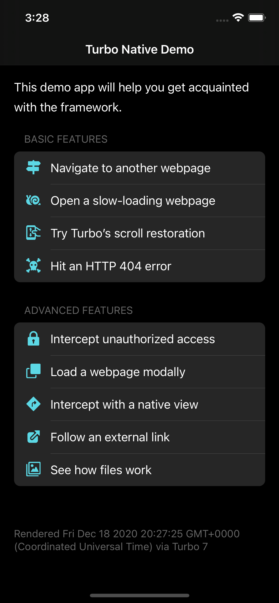

# Demo

Open `Demo.xcodeproj` and run the `Demo` app target. By default, the demo app loads a remotely hosted Turbo demo app. The demo app itself describes the various features it supports and you can navigate through the app to explore.

You can also clone that demo app to experiment from [https://github.com/hotwired/turbo-native-demo](https://github.com/hotwired/turbo-native-demo). Once the local demo server is running, then you just need to change `Demo.current` to use `local` in `Demo/Demo.swift` to point to the local version of the demo.

